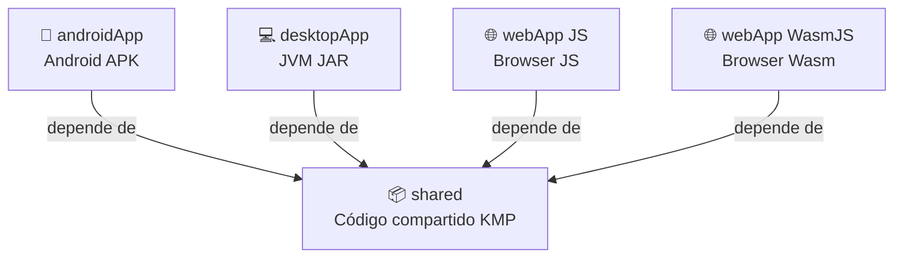
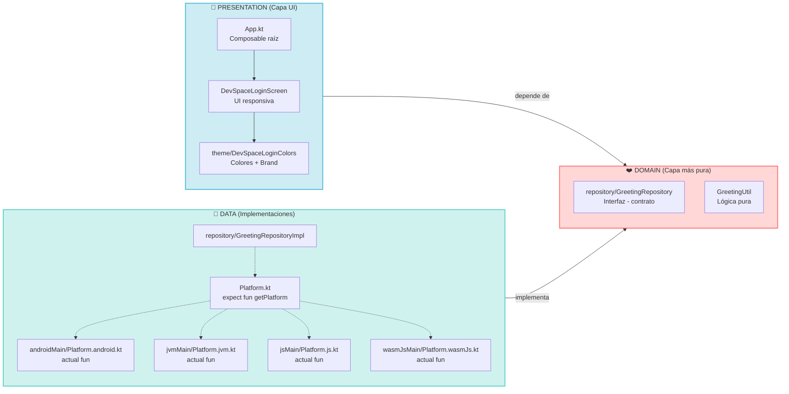
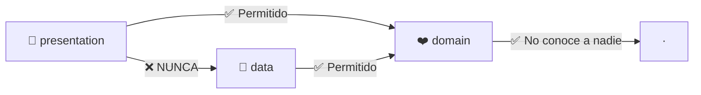
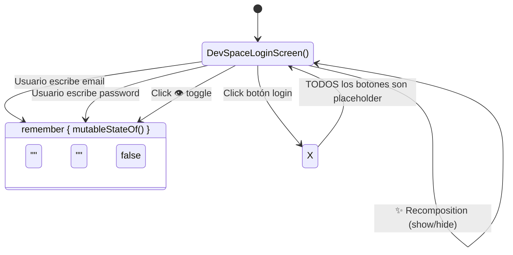
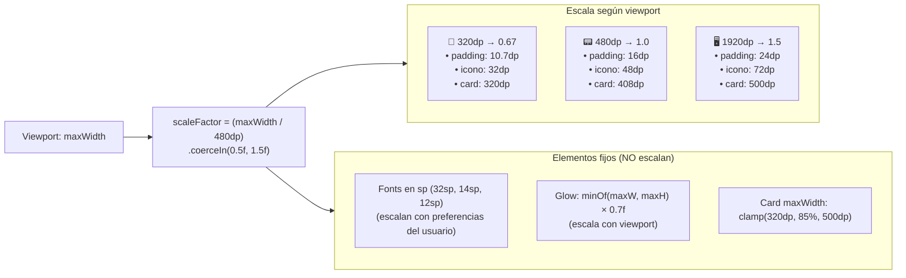
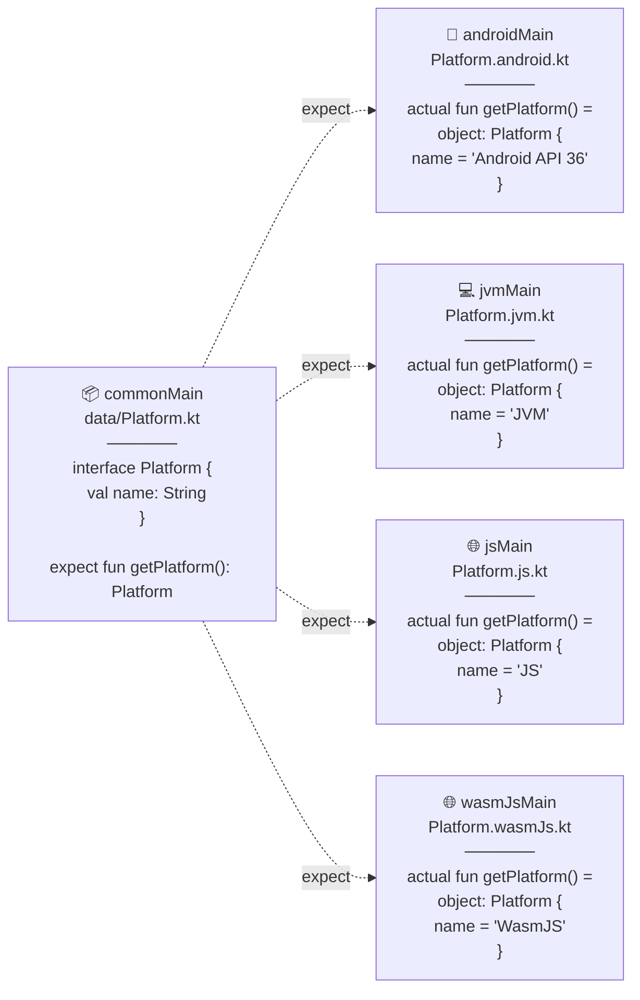
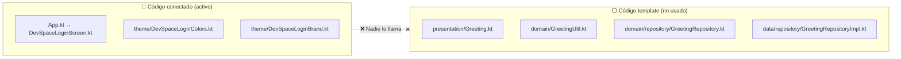

# CodeStash / Integrador

> **Stack:** Kotlin Multiplatform 2.4.0 + Compose Multiplatform 1.11.1 · Material 3  
> **Targets:** Android (API 24→36) · Desktop (JVM) · Web (JS + WasmJS)  
> **Arquitectura:** Package by Layer (3 capas)  
> **Testing:** `./gradlew :shared:allTests`

---

## Stack Tecnológico

| Capa | Tecnología | Versión |
|------|-----------|:-------:|
| **Lenguaje** | Kotlin Multiplatform | `2.4.0` |
| **UI** | Compose Multiplatform | `1.11.1` |
| **Material** | Material 3 | `1.11.0-alpha07` |
| **AGP** | Android Gradle Plugin | `9.2.1` |
| **Android** | `minSdk = 24` → `compileSdk = 36` → `targetSdk = 36` | — |
| **Desktop** | JVM | — |
| **Web** | JS (browser) + WasmJS (browser) | — |
| **Lifecycle** | AndroidX Lifecycle (ViewModel + Runtime Compose) | `2.11.0-beta01` |
| **Corrutinas** | Kotlinx Coroutines | `1.11.0` |
| **Testing** | Kotlin Test | `2.4.0` |
| **Build** | Gradle + Version Catalog (`libs.versions.toml`) | — |

---

## Módulos



**Toda la lógica y UI vive en `shared/`**. Los módulos `*App/` son wrappers mínimos que arrancan la plataforma correspondiente y llaman a `App()`.

---

## Arquitectura: Package by Layer (3 capas)



### Reglas de dependencia



> **En criollo:** `domain` define **qué** se puede hacer (contratos). `data` implementa **cómo**. `presentation` solo conoce `domain`, jamás toca `data` directo.

---

## Puntos de entrada (4 plataformas → mismo `App()`)

```mermaid
flowchart LR
    ANDROID[🤖 MainActivity.kt] --> APP
    DESKTOP[💻 main.kt] --> APP
    WEB[🌐 main.kt] --> APP
    
    APP[📦 shared App()] --> MATERIAL[🎭 MaterialTheme]
    MATERIAL --> LOGIN[🚪 DevSpaceLoginScreen]
    
    ANDROID_STEP["enableEdgeToEdge()<br/>setContent { App() }"]
    DESKTOP_STEP["application {<br/>  Window { App() }<br/>}"]
    WEB_STEP["composeRender { App() }"]
    
    ANDROID -.-> ANDROID_STEP
    DESKTOP -.-> DESKTOP_STEP
    WEB -.-> WEB_STEP
```

**La magia de KMP:** Las 4 plataformas llaman al mismo `App()` de `shared/src/commonMain/`. El mismo código Compose corre sin cambios en Android, Desktop y Web.

---

## Flujo de Login (estado actual)

```mermaid
flowchart TB
    subgraph BOX["BoxWithConstraints (fillMaxSize, fondo #131313)"]
        direction TB
        
        SCALE["1️⃣ scaleFactor = (maxWidth/480dp).coerceIn(0.5f, 1.5f)"]
        GLOW_SIZE["2️⃣ glowSize = minOf(maxW,maxH)×0.7f<br/>.coerceIn(200dp, 800dp)"]
        
        subgraph GLOW["💡 Glow ambiental"]
            GLOW_BOX["Box(size=glowSize, Center)<br/>radialGradient(primaryContainer@0.08f → Transparent)"]
        end
        
        subgraph CARD["📋 Card principal"]
            TERM["Icono Terminal (48dp×scale)"]
            TITLE["DevSpace (32sp Bold)"]
            SLOGAN["Slogan: 'Donde la mente CREA,<br/>el programa GUARDA!'"]
            GOOGLE["🔘 Google Login<br/>onClick = { /* TODO */ }"]
            DIVIDER["Divider 'o'"]
            
            subgraph FORM["Formulario"]
                EMAIL["✉️ Email<br/>OutlinedTextField<br/>value = email ← mutableStateOf"]
                PASS["🔒 Password<br/>OutlinedTextField<br/>value = password ← mutableStateOf<br/>👁️ toggle visibilidad"]
                FORGOT["¿Has olvidado?<br/>onClick = { /* TODO */ }"]
            end
            
            LOGIN_BTN["🟦 Iniciar Sesión<br/>onClick = { /* TODO */ }"]
            
            subgraph FOOTER["Footer"]
                REG["¿No tienes cuenta? Regístrate<br/>onClick = { /* TODO */ }"]
                TERMS["Términos y Condiciones<br/>| Política de Privacidad<br/>onClick = { /* TODO */ }"]
            end
            
            SPACER["Spacer(80dp×scale)<br/>← evita solapamiento con brand"]
        end
        
        subgraph BRAND["🏷️ Brand (fijo BottomEnd, fuera del scroll)"]
            LOGO["🖼️ Logo Bison (56dp×scale, clamp 28..84dp)"]
            STUDIOS["Ztrene Studios (12sp×scale, clamp 9..16sp)"]
            VERSION["version 1.0"]
        end
        
        SCALE --> GLOW
        GLOW_SIZE --> GLOW
        GLOW --> CARD
        TERM --> TITLE
        TITLE --> SLOGAN
        SLOGAN --> GOOGLE
        GOOGLE --> DIVIDER
        DIVIDER --> FORM
        EMAIL --> PASS
        PASS --> FORGOT
        FORGOT --> LOGIN_BTN
        LOGIN_BTN --> FOOTER
        FOOTER --> SPACER
    end
```



### Estado actual: State Management in-Screen



### Lo que SÍ funciona hoy

| Interacción | Resultado |
|:-----------|:----------|
| Escribir email | ✅ `mutableStateOf` cambia → recomposición |
| Escribir password | ✅ `mutableStateOf` cambia → recomposición |
| Toggle 👁️ visibilidad | ✅ `mutableStateOf(false)` toggle → recomposición |
| Click "Iniciar sesión" | ❌ Placeholder (`/* TODO */`) |
| Click "Google Login" | ❌ Placeholder (`/* TODO */`) |
| Click "Regístrate" | ❌ Placeholder (`/* TODO */`) |
| Click "Términos" | ❌ Placeholder (`/* TODO */`) |
| Click "¿Has olvidado?" | ❌ Placeholder (`/* TODO */`) |

---

## Flujo Responsivo (BoxWithConstraints)



| Elemento | Fórmula | Clamp |
|----------|---------|:-----:|
| **scaleFactor** | `maxWidth / 480.dp` | `0.5f .. 1.5f` |
| **glowSize** | `minOf(maxW, maxH) * 0.7f` | `200.dp .. 800.dp` |
| **Card max width** | `maxWidth * 0.85f` | `320.dp .. 500.dp` |
| **Brand logo** | `56.dp * scaleFactor` | mínimo `40.dp` |
| **Padding/spacing** | `N.dp * scaleFactor` | — |
| **Font sizes** | `N.sp` (fijo, escala con preferencias del usuario) | — |

---

## Flujo Platform (expect / actual)



---

## Árbol de Componentes UI

```mermaid
graph TB
    MT[🎭 MaterialTheme]
    MT --> DLS[🚪 DevSpaceLoginScreen]
    
    DLS --> BWC[📦 BoxWithConstraints<br/>fondo #131313, fillMaxSize]
    
    BWC --> GLOW[💡 Box - Glow ambiental<br/>CircleShape, radialGradient]
    BWC --> CARD[📋 Column scrolleable<br/>widthIn={320..500dp}, Center]
    
    CARD --> TI[📦 Icono Terminal<br/>48dp×scale, fondo surfaceContainerHigh]
    CARD --> TITLE["🔤 'DevSpace'<br/>32sp, Bold, letterSpacing -0.5"]
    CARD --> SLOGAN["🔤 Slogan<br/>buildAnnotatedString, 14sp"]
    CARD --> GOOGLE[🔘 OutlinedButton<br/>'Iniciar sesión con Google']
    CARD --> DIV["➖ Row Divider<br/>'o continúa con...'"]
    
    CARD --> EMAIL_S["✉️ Email Column"]
    EMAIL_S --> EMAIL_L["Label: 'Correo electrónico'"]
    EMAIL_S --> EMAIL_F["OutlinedTextField<br/>icono Email, keyboardType=Email"]
    
    CARD --> PASS_S["🔒 Password Column"]
    PASS_S --> PASS_L["Row: 'Contraseña' + '¿Has olvidado?'"]
    PASS_S --> PASS_F["OutlinedTextField<br/>👁️ toggle visibilidad, keyboardType=Password"]
    
    CARD --> LOGIN_B["🟦 Button<br/>'Iniciar sesión'<br/>onClick = TODO"]
    CARD --> FOOTER["📜 Footer Column"]
    FOOTER --> REG["'¿No tienes cuenta? Regístrate'"]
    FOOTER --> TERMS["'Términos y Condiciones | Política de Privacidad'"]
    
    BWC --> BRAND_B[📦 Box<br/>Alignment.BottomEnd]
    BRAND_B --> BRAND_C["🏷️ Brand Column"]
    BRAND_C --> LOGO["🖼️ Image - Bison Logo<br/>56dp×scale, clamp 28..84dp"]
    BRAND_C --> ZTRE["🔤 'Ztrene Studios'<br/>12sp×scale, clamp 9..16sp"]
    BRAND_C --> VER["🔤 'version 1.0'<br/>10sp×scale"]
```

---

## Código Template No Conectado

La app **ignora completamente** el código template que viene con KMP:



---

## Cómo ejecutar

```bash
# Android - compilar
./gradlew :androidApp:assembleDebug

# Desktop - hot reload (recomendado)
./gradlew :desktopApp:hotRun --auto

# Desktop - producción
./gradlew :desktopApp:run

# Web - Wasm (navegadores modernos)
./gradlew :webApp:wasmJsBrowserDevelopmentRun

# Web - JS (navegadores legacy)
./gradlew :webApp:jsBrowserDevelopmentRun
```

## Tests

```bash
# Todos los tests (todas las plataformas)
./gradlew :shared:allTests

# Por plataforma
./gradlew :shared:testAndroidHostTest  # Android Host
./gradlew :shared:jvmTest              # Desktop (JVM)
./gradlew :shared:wasmJsTest           # Web Wasm
./gradlew :shared:jsTest               # Web JS
```

---

## Roadmap

### ✅ Fase 1 — Fundación (Completada)
- [x] Template KMP + Compose Multiplatform
- [x] Arquitectura Package by Layer
- [x] DevSpaceLoginScreen con UI responsiva
- [x] Documentación de flujos y arquitectura

### 🔜 Fase 2 — Autenticación (Siguiente)
- [ ] Lógica de login con ViewModel
- [ ] Validación de formularios
- [ ] Navegación Login → Home

### 📝 Fase 3 — Funcionalidad Core
- [ ] CRUD de snippets/notas
- [ ] Base de datos local (SQLite)
- [ ] Editor de código con syntax highlighting

### 🧹 Fase 4 — Calidad
- [ ] Tema light/dark automático
- [ ] Tests unitarios + instrumentados
- [ ] CI/CD con GitHub Actions

---

> **Última actualización:** Junio 2026  
> **Mantenido por:** Ztrene Studios
