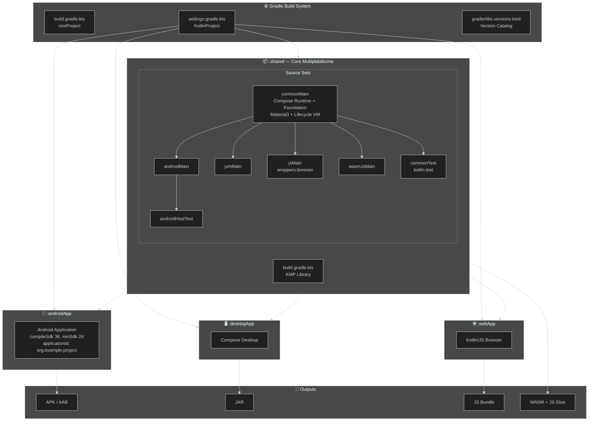
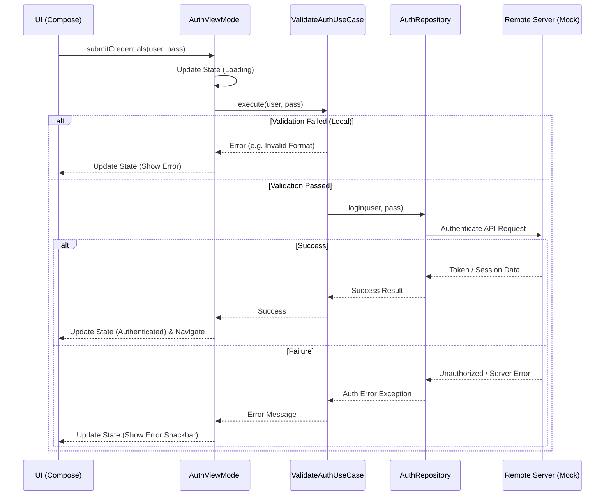

# CodeNest

CodeNest es un sistema multiplataforma enfocado en la centralización y gestión segura de flujos de autenticación. Resuelve la complejidad de mantener arquitecturas y validaciones de interfaz divergentes entre Android, Desktop y Web (Wasm/JS) unificando la lógica de negocio y la presentación bajo una única base de código mediante **Kotlin Multiplatform (KMP)** y **Compose Multiplatform**.

---

## 🏗️ Arquitectura y Tech Stack

CodeNest utiliza una arquitectura limpia (Clean Architecture) adaptada para un entorno multiplataforma, logrando reutilizar la máxima cantidad de código posible entre plataformas.

### Diagrama de Stack Tecnológico



---

## 🔄 Flujos de Datos y Autenticación

El sistema centraliza la lógica de negocio, asegurando que todas las plataformas ejecuten exactamente las mismas reglas de validación y flujos de autenticación sin duplicación de código.

### Flujo de Autenticación (Login)

Este diagrama de secuencia ilustra cómo interactúan las capas durante un intento de inicio de sesión:



### Arquitectura de Capas en el Módulo Shared

Las responsabilidades se dividen en 3 capas fundamentales siguiendo Clean Architecture:

```mermaid
graph TD
    UI[Presentation Layer\n(UI Compose Multiplatform, ViewModels, States)] --> Domain[Domain Layer\n(UseCases, Models, Repository Interfaces)]
    Data[Data Layer\n(Repository Impls, DTOs, Local/Remote DataSources)] -.->|Implementa| Domain
    
    subgraph Shared Module [Código Agnóstico de Plataforma]
    UI
    Domain
    Data
    end

    style UI fill:#3f51b5,stroke:#fff,stroke-width:2px,color:#fff
    style Domain fill:#009688,stroke:#fff,stroke-width:2px,color:#fff
    style Data fill:#ff9800,stroke:#fff,stroke-width:2px,color:#fff
```

---

## 🛠️ Requisitos Previos

- **JDK:** 17 o superior.
- **Android Studio:** Koala Feature Drop (o IntelliJ IDEA equivalente con plugins de KMP habilitados).
- **Kotlin:** 2.0.20
- **Gradle:** 8.7+

---

## 🚀 Instalación y Ejecución

Para configurar el entorno de desarrollo local, ejecuta los siguientes comandos en tu terminal:

```bash
git clone https://github.com/tu-usuario/CodeNest.git
cd CodeNest
./gradlew build
```

CodeNest está diseñado para ejecutarse localmente sin configuración de backend en su fase actual, utilizando repositorios mockeados inyectados vía **Koin** (Inyección de Dependencias multiplataforma).

### 📱 Android
Para compilar e instalar el APK de debug en un emulador o dispositivo Android conectado:
```bash
./gradlew :androidApp:installDebug
```

### 🖥️ Desktop
Para iniciar la aplicación en tu entorno de escritorio (JVM):
```bash
./gradlew :desktopApp:run
```

### 🌐 Web (Wasm)
Para compilar y probar la aplicación web usando Kotlin/Wasm en tu navegador local:
```bash
./gradlew :webApp:wasmJsBrowserRun
```

---

## 📁 Estructura del Proyecto

El proyecto está organizado de la siguiente manera:

```text
CodeNest/
├── androidApp/        # Punto de entrada específico para Android (MainActivity).
├── desktopApp/        # Punto de entrada para aplicaciones JVM de escritorio.
├── webApp/            # Punto de entrada para JS/Wasm (ComposeViewport).
└── shared/            # Código agnóstico de plataforma. Contiene el core del sistema:
    ├── di/            # Configuración de Inyección de Dependencias (AppModule, Koin).
    ├── data/          # Implementación de repositorios (AuthRepositoryImpl con mocks).
    ├── domain/        # Casos de uso puros y contratos (ValidateEmailUseCase, AuthRepository).
    └── presentation/  # Componentes UI de Compose Multiplatform, State y ViewModels.
```

---

## ⚙️ Variables de Entorno

Actualmente, el proyecto opera localmente y no depende de variables de entorno externas ni tokens de API para su compilación y ejecución inicial.

| Nombre | Descripción | Ejemplo | Obligatoria |
|---|---|---|---|
| N/A | Ninguna configurada en la fase actual de desarrollo. | N/A | Falso |

---

## 🧪 Ejecución de Tests

Para validar la lógica de negocio (Casos de Uso) y los flujos de estado del ViewModel en la capa compartida (asegurando que las reglas funcionen idénticamente en todas las plataformas), ejecuta:

```bash
./gradlew :shared:test
```

---

## 🤝 Cómo Contribuir

1. Haz un fork del repositorio.
2. Crea una rama para tu feature (`git checkout -b feature/nueva-autenticacion`).
3. Asegúrate de respetar el Principio de Responsabilidad Única (SRP) en cada cambio arquitectónico. Documenta tus funciones públicas utilizando KDoc.
4. Haz commit de tus cambios (`git commit -m "feat: implementar validación estricta"`).
5. Abre un Pull Request describiendo detalladamente la necesidad técnica que resuelve.
