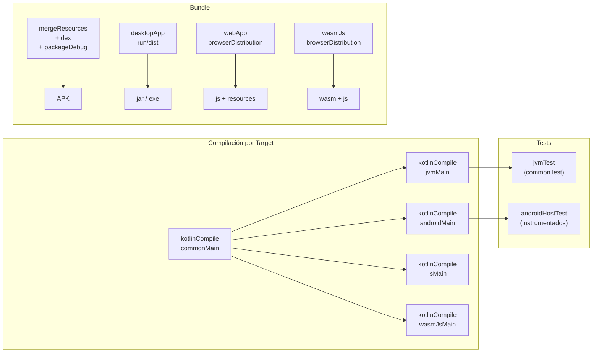
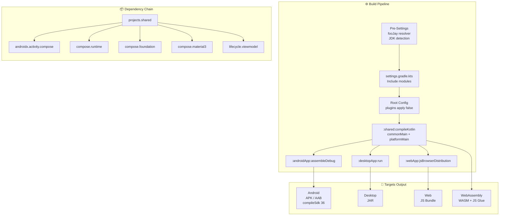

# Diagrama de Flujo — Integrador (KMP)

## Estructura General

```mermaid
graph TB
    subgraph Gradle["⚙️ Gradle Build System"]
        Root["build.gradle.kts<br/>rootProject"]
        Settings["settings.gradle.kts<br/>KotlinProject"]
        Catalog["gradle/libs.versions.toml<br/>Version Catalog"]
        Props["gradle.properties"]
        Local["local.properties"]
        Plugins["Plugins:<br/>• androidApplication<br/>• androidMultiplatformLibrary<br/>• composeMultiplatform<br/>• composeCompiler<br/>• kotlinMultiplatform<br/>• kotlinJvm"]
    end

    subgraph Shared["📦 :shared — Core Multiplataforma"]
        direction TB
        BS["build.gradle.kts<br/>KMP Library"]
        BS --> NS["Namespace: org.example.project.shared"]
        BS --> CS["compileSdk: 36, minSdk: 24"]
        BS --> JT["JVM Target: 11"]

        subgraph Sources["Source Sets"]
            CM["commonMain<br/>🔹 Compose Runtime<br/>🔹 Compose Foundation<br/>🔹 Material3<br/>🔹 Lifecycle ViewModel<br/>🔹 Compose Resources<br/>🔹 Material Icons Extended"]
            CT["commonTest<br/>🔹 kotlin.test"]

            AM["androidMain<br/>🔹 compose.uiToolingPreview"]
            JM["jvmMain"]
            JSM["jsMain<br/>🔹 wrappers.browser"]
            W["wasmJsMain"]
            AHT["androidHostTest<br/>🔹 isIncludeAndroidResources"]
        end

        CM --> |expect| AM
        CM --> |expect| JM
        CM --> |expect| JSM
        CM --> |expect| W
        CM --> CT
        AM --> AHT
    end

    subgraph AndroidApp["📱 :androidApp"]
        AA["build.gradle.kts<br/>Android Application"]
        AA --> AN["Namespace: org.example.project"]
        AA --> AID["applicationId: org.example.project"]
        AA --> ASDK["compileSdk: 36, targetSdk: 36, minSdk: 24"]
        AA --> AJT["JVM Target: 11"]
        AA --> ADEPS["Deps:<br/>• projects.shared<br/>• androidx.activity.compose<br/>• compose.uiTooling"]
        AA --> APK["Output: .apk / .aab"]
    end

    subgraph DesktopApp["🖥️ :desktopApp"]
        DA["build.gradle.kts<br/>Compose Desktop"]
        DA --> DDEPS["Deps:<br/>• projects.shared"]
        DA --> JAR["Output: .jar"]
    end

    subgraph WebApp["🌐 :webApp"]
        WA["build.gradle.kts<br/>Kotlin/JS"]
        WA --> WDEPS["Deps:<br/>• projects.shared"]
        WA --> WB["Output: .js bundle"]
    end

    subgraph Artifacts["📁 Producción"]
        APK["androidApp.jar → .apk"]
        AJAR["desktopApp.jar → app.jar"]
        WJS["webApp.js → bundle.js"]
        WWASM["wasmJsMain → .wasm"]
    end

    subgraph BuildOutput["📂 Build Outputs"]
        B1["build/classes/kotlin/*/main<br/>Class files por target"]
        B2["build/dist/wasmJs/productionExecutable/"]
        B3["build/dist/js/productionExecutable/"]
    end

    Root --> Settings
    Settings --> Shared
    Settings --> AndroidApp
    Settings --> DesktopApp
    Settings --> WebApp

    Catalog --> Shared
    Catalog --> AndroidApp

    Shared --> |implementation projects.shared| AndroidApp
    Shared --> |implementation projects.shared| DesktopApp
    Shared --> |implementation projects.shared| WebApp

    AndroidApp --> APK
    DesktopApp --> JAR
    WebApp --> WB
    Shared --> WWASM

    AndroidApp --> BuildOutput
    DesktopApp --> BuildOutput
    WebApp --> BuildOutput

    CT --> |test task| B1
    AHT --> |test task| B1
```

## Flujo de Compilación por Target

```mermaid
graph LR
    subgraph Compile["Compilación por Target"]
        direction LR
        CC["kotlinCompile<br/>commonMain"] --> AC["kotlinCompile<br/>androidMain"]
        CC --> JC["kotlinCompile<br/>jvmMain"]
        CC --> JSC["kotlinCompile<br/>jsMain"]
        CC --> WC["kotlinCompile<br/>wasmJsMain"]
    end

    subgraph Test["Tests"]
        T1["jvmTest<br/>(commonTest)"]
        T2["androidHostTest<br/>(instrumentados)"]
    end

    AC --> T2
    JC --> T1

    subgraph Bundle["Bundle"]
        direction TB
        A["mergeResources<br/>+ dex<br/>+ packageDebug"] --> APK
        D["desktopApp<br/>run/dist"] --> EXE["jar / exe"]
        W["webApp<br/>browserDistribution"] --> BUNDLE["js + resources"]
        WASM["wasmJs<br/>browserDistribution"] --> WBUNDLE["wasm + js"]
    end
```

## Pipeline Completo

```mermaid
flowchart TB
    subgraph Build["⚙️ Build Pipeline"]
        direction LR
        PS["Pre-Settings<br/>fooJay resolver<br/>JDK detection"] --> S["settings.gradle.kts<br/>Include modules"]
        S --> RC["Root Config<br/>plugins apply false"]
        RC --> SM[":shared:compileKotlin<br/>commonMain + platformMain"]
        SM --> AL[":androidApp:assembleDebug"]
        SM --> DL[":desktopApp:run"]
        SM --> WL[":webApp:jsBrowserDistribution"]
    end

    subgraph Dependencies["📦 Dependency Chain"]
        direction TB
        SH["projects.shared"] --> AC["androidx.activity.compose"]
        SH --> CR["compose.runtime"]
        SH --> CF["compose.foundation"]
        SH --> CM3["compose.material3"]
        SH --> LV["lifecycle.viewmodel"]
    end

    subgraph Targets["🎯 Targets Output"]
        AND["Android<br/>APK / AAB<br/>compileSdk 36"]
        DESK["Desktop<br/>JAR"]
        WEB["Web<br/>JS Bundle"]
        WASM["WebAssembly<br/>WASM + JS Glue"]
    end

    AL --> AND
    DL --> DESK
    WL --> WEB
    SM --> WASM
```
