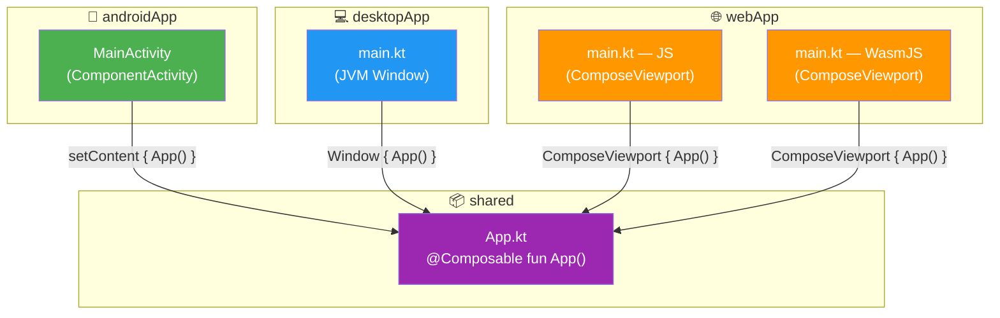
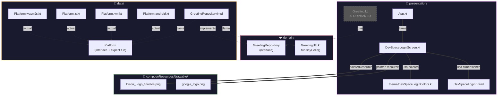
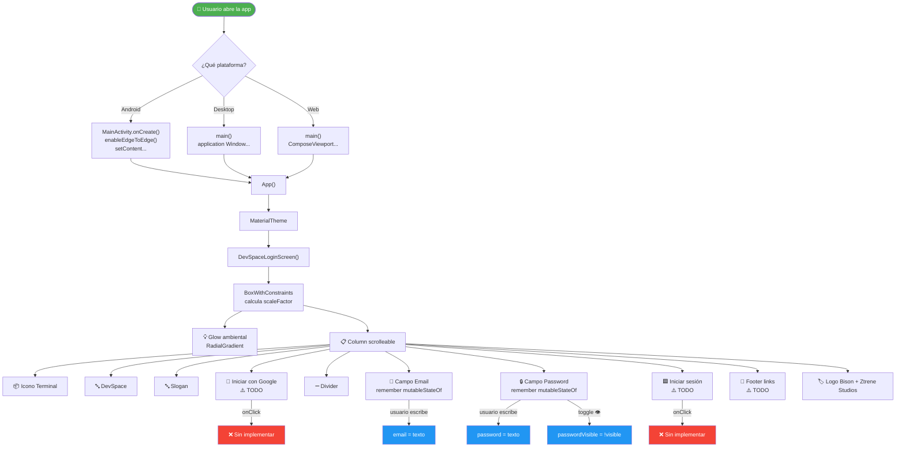

# 🏗️ Software Structure — CodeStash / Integrador

> **Stack:** Kotlin Multiplatform 2.4.0 + Compose Multiplatform 1.11.1
> **Targets:** Android (API 24→36) · Desktop (JVM) · Web (JS + WasmJS)
> **Arquitectura:** Package by Layer (3 capas)
> **Testing:** `./gradlew :shared:allTests`

---

## 📑 Tabla de Contenidos

| # | Sección | Para qué sirve |
|---|---------|---------------|
| 1 | [Stack Tecnológico](#1-stack-tecnológico) | Versiones de cada tecnología |
| 2 | [Arquitectura](#2-arquitectura--package-by-layer) | Cómo está organizado el código |
| 3 | [Flujo de Login](#3-flujo-de-login) | Qué pasa cuando se abre la app |
| 4 | [Layout Responsive](#4-fórmulas-del-layout-responsive) | Cómo escala la UI |
| 5 | [Pantallas](#5-pantallas-implementadas) | Qué está hecho y qué falta |
| 6 | [Testing](#6-testing) | Cómo se testea |
| 7 | [Decisiones](#7-decisiones-de-arquitectura) | Por qué se eligió cada cosa |
| 8 | [Flujo SDD](#8-flujo-de-trabajo-sdd) | Cómo trabajamos los cambios |
| 9 | [Dependencias](#9-módulos-y-dependencias) | Quién depende de quién |
| 10 | [Entry Points](#10-puntos-de-entrada) | Dónde arranca cada plataforma |
| 11 | [Component Tree](#11-árbol-de-componentes-ui) | Árbol completo de la UI |
| 12 | [Estado](#12-manejo-de-estado) | State management actual |
| 13 | [Build](#13-estructura-del-build) | Archivos de Gradle |
| 14 | [Decisiones Técnicas](#14-decisiones-técnicas-y-por-qué) | Tradeoffs y alternativas |
| 15 | [Roadmap](#15-roadmap-del-proyecto) | Plan a futuro |
| 16 | [Logo](#16-logo) | Branding Bison Studios |
| 17 | [Diagramas de Flujo](#17-diagramas-de-flujo) | Cómo se comunican los componentes |

---

## 1. Stack Tecnológico

| Capa | Tecnología | Versión |
|------|-----------|:-------:|
| 🛡️ **Lenguaje** | Kotlin Multiplatform | `2.4.0` |
| 🎨 **UI** | Compose Multiplatform | `1.11.1` |
| 📐 **Material Design** | Material 3 | `1.11.0-alpha07` |
| 🤖 **AGP** | Android Gradle Plugin | `9.2.1` |
| 📱 **Android** | `minSdk = 24` → `compileSdk = 36` → `targetSdk = 36` | — |
| 💻 **Desktop** | JVM | — |
| 🌐 **Web** | JS (browser) + WasmJS (browser) | — |
| 🔄 **Lifecycle** | AndroidX Lifecycle (ViewModel + Runtime Compose) | `2.11.0-beta01` |
| ⚡ **Corrutinas** | Kotlinx Coroutines | `1.11.0` |
| 🧪 **Testing** | Kotlin Test | `2.4.0` |
| 🏗️ **Build** | Gradle + Version Catalog | — |
| 📦 **Kotlin Wrappers** | kotlin-browser | `2026.6.1` |

### 📂 Módulos del proyecto

```
Integrador/
├── 🤖 androidApp/     → Entry point Android
├── 💻 desktopApp/     → Entry point Desktop (JVM)
├── 🌐 webApp/         → Entry point Web (JS + WasmJS)
├── 📦 shared/         → Código compartido (KMP) ← **ACÁ TRABAJAMOS**
└── ⚙️  gradle/        → Version catalog (libs.versions.toml)
```

---

## 2. Arquitectura — Package by Layer

Toda la lógica vive en **`shared/src/commonMain/kotlin/org/example/project/`**.

```
📁 shared/src/commonMain/kotlin/org/example/project/
│
├── 📂 domain/                    ← ❤️ CAPA DOMINIO (la más pura)
│   ├── GreetingUtil.kt
│   └── repository/
│       └── GreetingRepository.kt   ← Interfaz (contrato)
│
├── 📂 data/                      ← 🔧 CAPA DATA (implementaciones)
│   ├── Platform.kt
│   └── repository/
│       └── GreetingRepositoryImpl.kt  ← Implementación concreta
│
└── 📂 presentation/              ← 🎨 CAPA PRESENTACIÓN (UI Compose)
    ├── App.kt                 ← Entry point Composable raíz
    ├── Greeting.kt
    ├── DevSpaceLoginScreen.kt ← Pantalla Login
    └── theme/
        └── DevSpaceLoginColors.kt  ← Colores extraídos
```

### Reglas de dependencia

```
presentation ──→ domain    ✅ Permitido
presentation ──→ data      ❌ NUNCA (violación de arquitectura)
data         ──→ domain    ✅ Permitido
domain       ──→ nada      ✅ Capa más pura, sin dependencias externas
```

> **💡 En criollo:** `domain` es el corazón — define **qué** se puede hacer (contratos). `data` implementa **cómo** se hace. `presentation` solo conoce `domain`, jamás toca `data` directo.

---

## 3. Flujo de Login

```
Usuario abre app
       │
       ▼
┌────────────────────────────────┐
│  App.kt                        │
│  └── MaterialTheme             │
│       └── DevSpaceLoginScreen  │
│            ├── Glow ambiental   │
│            └── Column central   │
│                 ├── Terminal    │
│                 ├── "DevSpace"  │
│                 ├── Slogan      │
│                 ├── Google btn  │  ← TODO
│                 ├── Formulario  │
│                 │   ├── Email   │
│                 │   └── Pass    │
│                 ├── Login btn   │  ← TODO
│                 ├── Footer      │
│                 └── Brand       │
└────────────────────────────────┘
```

### 📐 Responsive behavior

| Viewport | Scale | Glow | Card | Scroll |
|:--------:|:-----:|:----:|:----:|:------:|
| 📱 **320dp** (phone) | `0.67` | `224dp` | `320dp` | ✅ Sí |
| 📟 **480dp** (tablet) | `1.0` | `336dp` | `408dp` | ⚠️ Tal vez |
| 🖥️ **1920dp** (desktop) | `1.5` | `800dp` | `500dp` | ❌ No |

---

## 4. Fórmulas del Layout Responsive

| Elemento | Fórmula | Clamp |
|----------|---------|:-----:|
| 📐 **scaleFactor** | `maxWidth / 480.dp` | `0.5f .. 1.5f` |
| 💡 **glowSize** | `minOf(maxW, maxH) * 0.7f` | `200.dp .. 800.dp` |
| 🃏 **Card max width** | `maxWidth * 0.85f` | `320.dp .. 500.dp` |
| 🖼️ **Brand logo** | `56.dp * scaleFactor` | mínimo `40.dp` |
| 📏 **Padding/spacing** | `N.dp * scaleFactor` | — |
| 🔤 **Font sizes** | `N.sp` (fijo, escala con preferencias del usuario) | — |

---

## 5. Pantallas Implementadas

| Pantalla | Archivo | Estado |
|----------|---------|:------:|
| 🚪 **DevSpaceLogin** | `presentation/DevSpaceLoginScreen.kt` | ✅ Layout responsive, sin lógica |
| 🏠 **App (raíz)** | `presentation/App.kt` | ✅ Muestra DevSpaceLoginScreen |

### 📋 Pendientes (TODO)

- [ ] 🔐 **Lógica de login** — autenticación con validación
- [ ] 🧭 **Navegación** — Login → Home y futuras pantallas
- [ ] 📝 **Sistema de notas / snippets**
- [ ] ✏️ **Editor de código** con syntax highlighting
- [ ] 💾 **Base de datos local**
- [ ] 🌗 **Temas** light/dark mode

---

## 6. Testing

| Aspecto | Detalle |
|---------|---------|
| 🧪 **Framework** | Kotlin Test (built-in KMP) |
| 🚀 **Comando** | `./gradlew :shared:allTests` |
| 🎯 **Targets** | JVM · JS (browser) · WasmJS (browser) · Android |
| 📊 **Cobertura actual** | Solo tests template (Greeting) |

> ⚠️ **Nota:** Por ahora solo hay tests del template original. Cada cambio nuevo debería incluir sus tests.

---

## 7. Decisiones de Arquitectura

| Decisión | Artefacto | Fecha |
|----------|-----------|:-----:|
| 📁 Package by Layer (3 capas) | `sdd/disenio-arquitectura-inicial` | 2026-06-04 |
| 📐 BoxWithConstraints + scaleFactor | `sdd/reduccion-login` | 2026-06-05 |
| 🎨 Colores extraídos a objeto separado | `presentation/theme/DevSpaceLoginColors.kt` | 2026-06-05 |
| ✏️ SyntaxMP para syntax highlighting | Engram decision #53 | 2026-06-04 |

---

## 8. Flujo de Trabajo SDD

```
┌─────────┐    ┌───────────┐    ┌──────────┐    ┌─────────┐    ┌──────────┐    ┌──────────┐
│ 🔍      │ → │ 📋        │ → │ 📐       │ → │ ✅      │ → │ 💻       │ → │ 🧪       │
│ Explore │   │ Proposal   │   │ Design   │   │ Tasks   │   │ Apply    │   │ Verify   │
│ (idea)  │   │ (qué)     │   │ Specs    │   │ (cómo)  │   │ (código) │   │ (testing)│
│         │   │           │   │ (reqs)   │   │         │   │          │   │          │
└─────────┘   └───────────┘   └──────────┘   └─────────┘   └──────────┘   └──────────┘
                                                                               │
                                                                          ┌────┘
                                                                          ▼
                                                                     ┌──────────┐
                                                                     │ 📦       │
                                                                     │ Archive  │
                                                                     │ (listo)  │
                                                                     └──────────┘
```

---

## 9. Módulos y Dependencias

```
                     ┌─────────────────────┐
                     │     📦 shared        │
                     │  (código compartido) │
                     └────────┬────────────┘
                              │
          ┌───────────────────┼───────────────────┐
          ▼                   ▼                   ▼
┌─────────────────┐ ┌─────────────────┐ ┌─────────────────┐
│  🤖 androidApp  │ │  💻 desktopApp  │ │  🌐 webApp      │
│  (Android APK)  │ │  (JVM JAR)      │ │  (JS + Wasm)    │
└─────────────────┘ └─────────────────┘ └─────────────────┘
```

Cada módulo `*App/` es un **wrapper mínimo** que arranca la plataforma y llama a `App()` de `shared`. Toda la UI y lógica de negocio vive en `shared/`.

---

## 10. Puntos de Entrada

| Plataforma | Archivo | Código |
|:----------:|---------|--------|
| 🤖 **Android** | `androidApp/.../MainActivity.kt` | `setContent { App() }` |
| 💻 **Desktop** | `desktopApp/.../Main.kt` | `application { Window { App() } }` |
| 🌐 **Web (JS)** | `webApp/src/jsMain/.../Main.kt` | `composeRender { App() }` |
| 🌐 **Web (Wasm)** | `webApp/src/wasmJsMain/.../Main.kt` | `composeRender { App() }` |

> **✨ La magia de KMP:** Las 4 plataformas llaman al mismo `App()` de `shared/src/commonMain/`. El mismo código Compose corre sin cambios en Android, Desktop y Web.

---

## 11. Árbol de Componentes UI

```
🎭 MaterialTheme
 │
 └── 🚪 DevSpaceLoginScreen
      │
      ├── 🟦 BoxWithConstraints (fondo oscuro, responsivo)
      │    │
      │    ├── 💡 Box — Glow ambiental radial (CircleShape)
      │    │
      │    └── 📋 Column (scrolleable, centrada)
      │         │
      │         ├── 📦 Box — Icono Terminal (48dp)
      │         ├── 🔤 Text — "DevSpace" (32sp, Bold)
      │         ├── 🔤 Text — Slogan con buildAnnotatedString
      │         ├── 🔘 OutlinedButton — "Iniciar sesión con Google"
      │         ├── ➖ Row — Divider "o continúa con..."
      │         │
      │         ├── 📧 Column — Email
      │         │    ├── Label "Correo electrónico"
      │         │    └── OutlinedTextField + icono Email
      │         │
      │         ├── 🔒 Column — Password
      │         │    ├── Row: "Contraseña" + "¿Has olvidado?"
      │         │    └── OutlinedTextField + toggle visibilidad
      │         │
      │         ├── 🟦 Button — "Iniciar sesión"  ← TODO
      │         │
      │         ├── 📜 Column — Footer
      │         │    ├── "¿No tienes cuenta? Regístrate"
      │         │    └── "Términos | Privacidad"
      │         │
      │         └── 🏷️ Column — Brand
      │              ├── 🖼️ Image — Logo Bison Studios
      │              └── 🔤 Text — "Ztrene Studios"
```

---

## 12. Manejo de Estado

### Estado actual (local con remember)

| Variable | Tipo | Declaración |
|:--------:|:----:|:-----------:|
| ✉️ `email` | `String` | `remember { mutableStateOf("") }` |
| 🔑 `password` | `String` | `remember { mutableStateOf("") }` |
| 👁️ `passwordVisible` | `Boolean` | `remember { mutableStateOf(false) }` |

### 🔍 Cómo funciona hoy

- Estado **local** dentro del Composable
- Los botones tienen `onClick = { /* TODO */ }` — sin lógica real
- No hay ViewModel, ni repositorio, ni llamadas HTTP

### 📈 Próximo paso

> Inyectar un **ViewModel** con `lifecycle-viewmodel-compose` que gestione el estado y la lógica de autenticación. El ViewModel se comunicará con `domain/repository/` (interfaz) y `data/repository/` (implementación con Firebase o Supabase).

---

## 13. Estructura del Build

```
📁 Integrador/
│
├── 📄 build.gradle.kts           → Plugin raíz (apply false)
├── 📄 settings.gradle.kts        → Módulos + repositorios
├── 📄 gradle.properties          → Propiedades de build
├── 🔒 local.properties           → SDK path (gitignored)
│
├── 📁 gradle/
│   ├── 📁 wrapper/
│   │   ├── gradle-wrapper.jar
│   │   └── gradle-wrapper.properties
│   └── 📄 libs.versions.toml     → Version Catalog
│
├── 📁 shared/
│   └── 📄 build.gradle.kts       → KMP + Compose + Android Library
│
├── 📁 androidApp/
│   └── 📄 build.gradle.kts       → Android Application
│
├── 📁 desktopApp/
│   └── 📄 build.gradle.kts       → JVM Application
│
└── 📁 webApp/
    └── 📄 build.gradle.kts       → JS + WasmJS Application
```

### 🔢 Versiones Android

| Parámetro | Valor |
|:---------:|:-----:|
| `compileSdk` | `36` |
| `minSdk` | `24` |
| `targetSdk` | `36` |

> **Nota:** Estos valores están hardcodeados directamente en cada `build.gradle.kts`, no en el version catalog. Si necesitás cambiarlos, editá `shared/build.gradle.kts` y `androidApp/build.gradle.kts`.

---

## 14. Decisiones Técnicas y Por Qué

| Decisión | Alternativas | Por qué esta |
|:---------|:-------------|:-------------|
| 🏗️ **KMP + Compose Multiplatform** | Flutter, React Native, nativo separado | Mismo lenguaje (Kotlin) en backend y frontend. Tipado fuerte, rendimiento nativo, Compose declarativo |
| 📁 **Package by Layer** | Package by Feature, Hexagonal | Simple para arrancar. Fácil de entender para alguien que empieza. Escalable a futuro |
| 📐 **BoxWithConstraints** | `onSizeChanged` + `rememberState` | API declarativa, menos código, evita recomposiciones manuales |
| 🎨 **Material 3** | Material 2 | Último estándar de Google, diseño moderno, mejor soporte |
| ❌ **Sin DI (Hilt/Koin)** | Hilt, Koin, Kodein | Proyecto chico, no justifica overhead. Se agrega cuando crezca |
| ❌ **Sin Navigation** | Navigation Compose, Voyager | Solo 1 pantalla. Se agrega con la 2da pantalla |

---

## 15. Roadmap del Proyecto

### ✅ Fase 1 — Fundación (Completada)

- [x] Template KMP + Compose Multiplatform
- [x] Arquitectura Package by Layer
- [x] DevSpaceLoginScreen con UI responsiva

### 🔜 Fase 2 — Autenticación (Siguiente)

- [ ] Lógica de login con ViewModel
- [ ] Validación de formularios
- [ ] Navegación Login → Home

### 📝 Fase 3 — Funcionalidad Core

- [ ] CRUD de snippets/notas
- [ ] Base de datos local (SQLite)
- [ ] Editor de código con syntax highlighting

### 🧹 Fase 4 — Calidad

- [ ] Tema light/dark automático
- [ ] Tests unitarios + instrumentados
- [ ] CI/CD con GitHub Actions


---

## 17. Diagramas de Flujo

### 🗂️ 17.1 — Dependencia entre Módulos

Cómo cada plataforma depende del módulo `shared`:



### 🔄 17.2 — Flujo Interno Completo (Capas)

Cómo se comunican las 3 capas dentro de `shared/`:



> **Leyenda:**
> - **Líneas sólidas (═══)** = flujo activo (se ejecuta hoy)
> - **Líneas punteadas (- - -)** = scaffolding existente pero **no conectado a la UI**
> - ⚠️ `Greeting.kt` está huérfano — existe pero ningún componente lo usa

### 👤 17.3 — Flujo de Interacción del Usuario

Qué pasa cuando el usuario abre la app e interactúa:



### 📊 17.4 — Resumen de Comunicación

| Desde | Hacia | Tipo | Estado |
|:------|:------|:-----|:------:|
| `androidApp` | `shared/App()` | Dependencia de módulo | ✅ Activo |
| `desktopApp` | `shared/App()` | Dependencia de módulo | ✅ Activo |
| `webApp` | `shared/App()` | Dependencia de módulo | ✅ Activo |
| `App.kt` | `DevSpaceLoginScreen` | Composable call | ✅ Activo |
| `DevSpaceLoginScreen` | `DevSpaceLoginColors` | Constantes de color | ✅ Activo |
| `DevSpaceLoginScreen` | `DevSpaceLoginBrand` | Constantes de tamaño | ✅ Activo |
| `DevSpaceLoginScreen` | `Res.drawable.*` | Compose Resources | ✅ Activo |
| `Greeting` | `GreetingRepository` | Interfaz dominio | ⚠️ Huérfano |
| `GreetingRepositoryImpl` | `getPlatform()` | Expect/actual | ⚠️ Huérfano |
| `GreetingRepositoryImpl` | `sayHello()` | Utilidad dominio | ⚠️ Huérfano |
| `DevSpaceLoginScreen` | ViewModel | State management | ❌ No existe aún |
| `DevSpaceLoginScreen` | Navegación | Router/Navigator | ❌ No existe aún |

---

> **📌 Última actualización:** 16 de junio de 2026
> **🧑‍💻 Mantenido por:** Bison / Ztrene Studios
